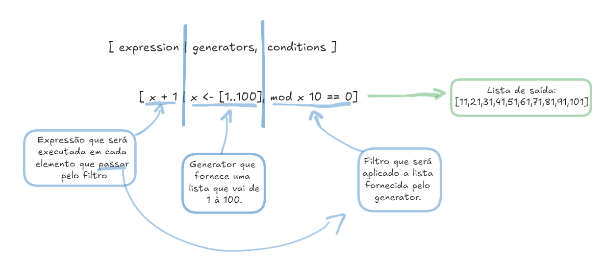

# List Comprehension X Filter

## Sintaxe:
` [ expression | generators, conditions ]`
- generators: Fornecem a lista de origem;
- conditions: São filtros a serem aplicados as listas de origem fornecidas pelos generators;
- expression: Expressão que será aplicada a cada valor da lista de origem;
## Exemplo:

## Exemplos de List Comprehension X Filter:
- O código acima:
List comprehension: `[x+1 | x <- [1..100], mod x 10 == 0]`
Usando Filter: `map (\x -> x+1) (filter (\x -> mod x 10 == 0) [1..100])`
*saida:* [11,21,31,41,51,61,71,81,91,101]

- Filtrar valores maiores que pi:
List comprehension: `[x | x <- [3.14, 3.15, 3.16, 3.17], x > pi]`
Filter: `filter (\x -> x > pi) [3.14, 3.15, 3.16, 3.17]`
*saida:* [3.15,3.16,3.17]

- Pegando Valores entre um intervalo de 10 à 20:
List Comprehension: `[x | x <- [0,2..20], x >= 10, x <= 20]`
Filter: `filter (\x -> x >= 10 && x <=20) [0,2..20]`
*saida:* [10,12,14,16,18,20]

- Filtrar e adicionar 'S ' na palavra que começa com A:
List Comprehension: `["S " ++ x | x <- ["Arco, "ametista", "Azul", "verde"], head x == 'A']`
Filter: `map (\x -> "S " ++ x) (filter (\y -> head y == 'A') ["Arco", "ametista", "Azul", "verde"])`
*saida:* ["S Arco","S Azul"]

## Conclusão:
List comprehensions em Haskell oferecem uma maneira sucinta, legível e poderosa de trabalhar com listas, combinando mapeamento e filtragem em uma única expressão.